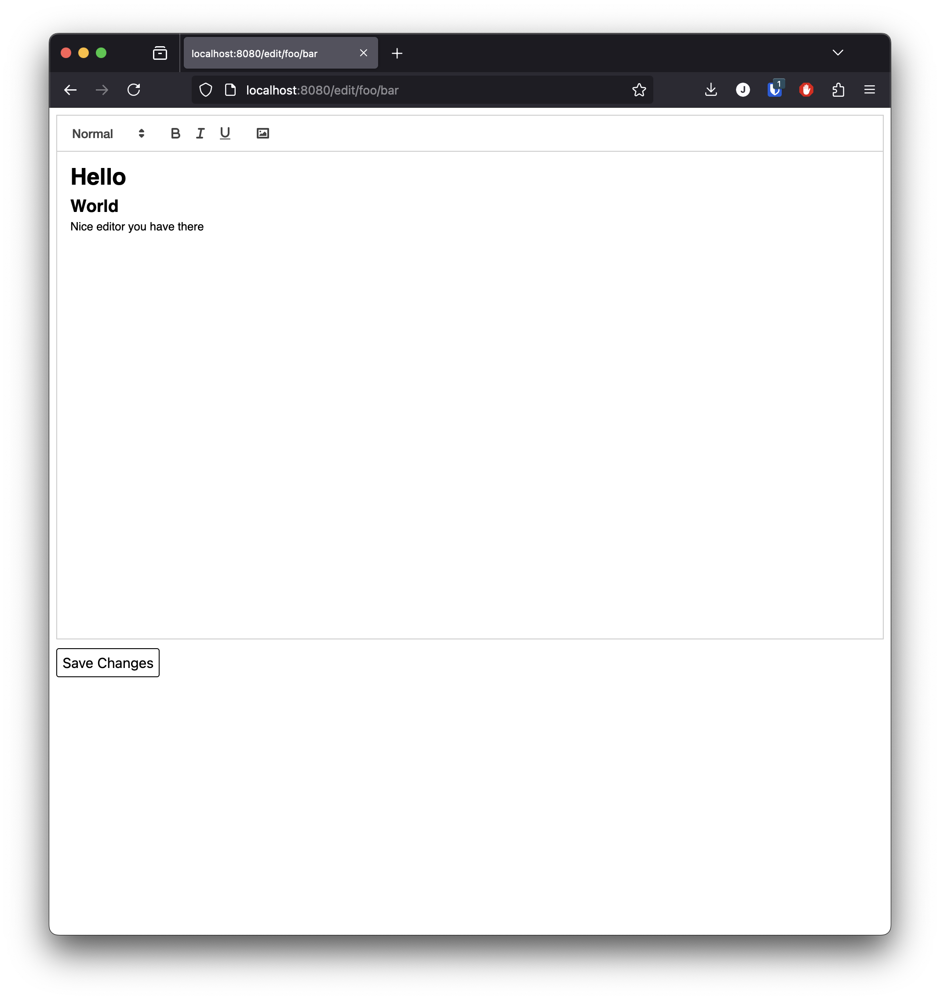

# Static Wiki Editor

Edit static sites without touching markdown or git!

- ⚡️ Use static site generators like Hugo to build collaborative sites like wikis
- 🤷‍♂️ Make editing easy for non-programmers
- 🌇 Supports image uploads
- 🪶 Built on the flexible [Quill](https://quilljs.com) editor

## Example

## Usage

TODO
